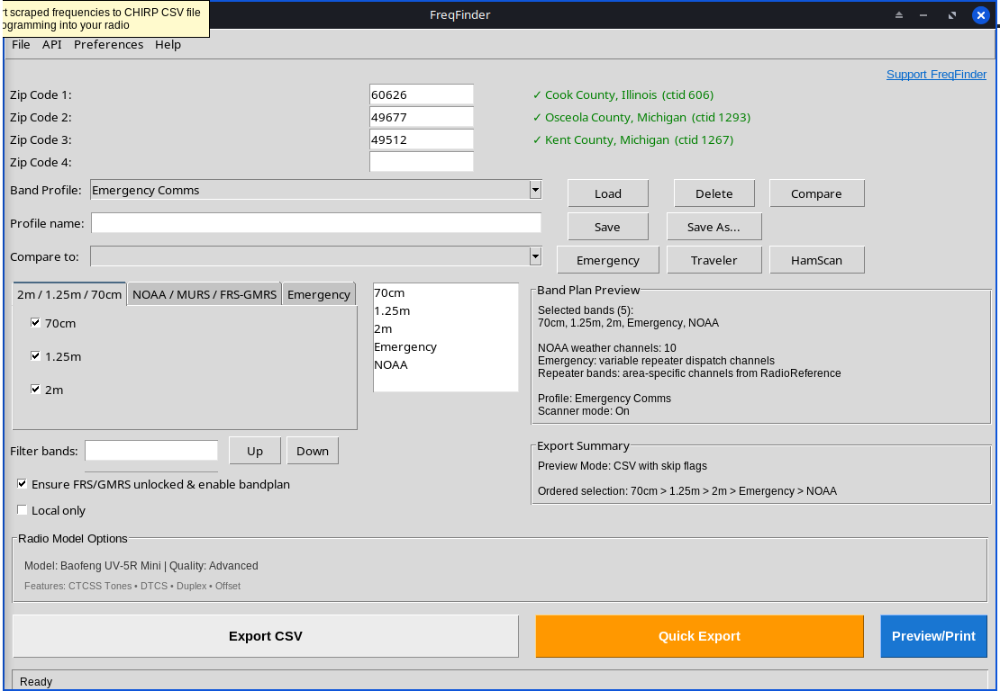

# FreqFinder RadioReference Scraper v2.0 🚀



Welcome to FreqFinder v2.0 — the latest release focused on cleaner export workflow, smarter band profiles, and better donation and documentation support.

This project uses a small index file, `radioref.csv`, to map RadioReference CTID pages (county/city titles) to their numeric CTID IDs. This file is required for ZIP-to-CTID mapping in the GUI and for accurate RadioReference lookups.

**If `radioref.csv` is missing or outdated, please see the [Troubleshooting](#troubleshooting) section below.**

**📚 Documentation**: See [docs/README_ENHANCEMENTS.md](docs/README_ENHANCEMENTS.md) for complete feature documentation, and [docs/CHANGELOG.md](docs/CHANGELOG.md) for version history and updates.

## Technical Business Profile 🏢

FreqFinder is a technical-business utility for radio data operations with a local-first workflow, packaging support, and practical automation for field and office teams.

- 🔐 Reliability-focused data collection and export workflows
- ⚙️ Automation-friendly CLI and GUI runtime
- 🖥️ Cross-platform packaging support for deployment
- 📊 CSV-first outputs for downstream operational pipelines

## Quick Start ✅

### Gradle (Java) local init

This repository supports both Python packaging and Gradle Java tooling. If you see "Gradle init" issues, use the bundled wrapper:

```bash
./gradlew --no-daemon --stacktrace --info clean build
./gradlew test
./gradlew run
```

If this repository is checked out without wrapper and you must regenerate:

```bash
gradle wrapper
./gradlew --no-daemon --stacktrace --info clean build
```

---

1. **One-step runtime (recommended)**

   Run the `freqfinder.sh` launcher to create or repair the virtual environment, install dependencies (including `pip==26.0.1`), and launch the app in GUI mode by default (no switches):

   Linux / macOS:

   ```bash
   ./freqfinder.sh
   ```

   Windows (PowerShell):

   ```powershell
   python FreqFinder
   ```

   Windows (cmd.exe):

   ```cmd
   python FreqFinder
   ```

2. **Manual setup (alternative)**

   If you prefer to create the venv yourself, follow the platform-specific steps below.

   Linux / macOS (bash/zsh):

   ```bash
   python3 -m venv .venv
   source .venv/bin/activate
   python -m pip install pip==26.0.1
   pip install -r requirements.txt
   python3 freqfinder.py --gui
   ```

   Windows (PowerShell):

   ```powershell
   python -m venv .venv
   .\.venv\Scripts\Activate.ps1
   python -m pip install pip==26.0.1
   pip install -r requirements.txt
   python freqfinder.py --gui
   ```

   Windows (cmd.exe):

   ```cmd
   python -m venv .venv
   .\.venv\Scripts\activate.bat
   pip install -r requirements.txt
   python freqfinder.py --gui
   ```

3. **Check output:**
   - Output files are generated in the project directory by default (e.g., `chirp_output.csv`).
   - Sample output in this repository is stored at `outputs/chirp_output.csv`.

## One Runtime File

Primary runtime command (GUI default, no switches):

```bash
./freqfinder.sh
```

Runtime launchers are kept in the main project directory for easy discovery:
- `freqfinder.sh`
- `bootstrap.py`

## Data Source Options

FreqFinder supports both:
- `RadioReference` as the primary repeater frequency source
- `Radio Browser` as a public, API-key-free broadcast station metadata source

For example, to fetch Radio Browser station metadata for ZIP codes without login:

```bash
python freqfinder.py --source radio_browser --pages 60626 94107 --output radio_browser_stations.csv
```

To show the QRZ helper stub and verify the integration point:

```bash
python freqfinder.py --qrz-stub
```

Use `bootstrap.py` as the single runtime entrypoint for install/run/test/security:

```bash
python3 bootstrap.py run        # install deps, then run app
python3 bootstrap.py install    # install deps only
python3 bootstrap.py test       # syntax + unittest smoke tests
python3 bootstrap.py security   # lightweight static security scan
python3 bootstrap.py package    # build one-time distributable for this OS
python3 bootstrap.py all        # install + security + test + run
```

Legacy flags still work (`--install-only`, `--test`, `--security-check`, `--gui`).

## Build App, DMG, EXE (One-Time Packaging)

Packaging is platform-native. Build on the target OS:

### Linux Onefile Binary

```bash
./scripts/build_linux_onefile.sh
```

Output:
- `dist/FreqFinder`

### macOS App + DMG

```bash
./scripts/build_macos_app_dmg.sh
```

Outputs:
- `dist/FreqFinder.app`
- `dist/FreqFinder.dmg`

### Windows EXE

Run in PowerShell:

```powershell
./scripts/build_windows_exe.ps1
```

Output:
- `dist/FreqFinder.exe`

Notes:
- `.app`/`.dmg` must be built on macOS.
- `.exe` must be built on Windows.
- A Linux build was generated in this workspace and verified with `--help` at `dist/FreqFinder`.

## Donations 🙏

Developing and maintaining open source software takes significant time and resources. Your support helps cover development, testing, hosting, and ongoing maintenance costs.

**🎁 Donation Portal**: A professional donation page appears on first launch. You can always reopen it from **Help → Contact → Donations** in the app menu.

**Note:** Donations are currently supported via PayPal and Cash App only.

### Why Donate? 💡
- Open source software fosters innovation and collaboration.
- Supports learning and skill development for programmers.
- Provides cost-effective solutions for everyone.
- Drives technological advancement and builds strong communities.

### Choose Your Donation Method

#### PayPal
[](https://paypal.me/Dr1zztD)

[paypal.me/Dr1zztD](https://paypal.me/Dr1zztD)

#### Cash App
[](https://cash.app/$teerRight)

[$teerRight](https://cash.app/$teerRight)

---

## Troubleshooting 🛠️

### Python Environment & Dependency Issues 🐍

**If you encounter numpy/pandas import errors:**

FreqFinder now supports Python 3.13 with properly compatible dependencies:
- **numpy 2.4.2+** - Required for Python 3.13 compatibility
- **pandas 3.0.0+** - Updated for latest numpy and Python versions

**Solution:**
If you already have an old venv, start fresh:

```bash
# Remove old environment
rm -rf .venv

# Create new environment and install dependencies
python3 -m venv .venv
source .venv/bin/activate  # (or .\.venv\Scripts\Activate.ps1 on Windows)
python -m pip install pip==26.0.1
pip install -r requirements.txt
```

The `bootstrap.py` script handles this automatically, so using it is recommended for a clean installation.

### RadioReference Index File (`radioref.csv`) 📂

If you see errors or missing data related to RadioReference lookups, or if `radioref.csv` is missing or outdated, you need to (re)generate the index file. Use the helper script below:

#### Generate or Update `radioref.csv`

Run this command to crawl RadioReference and build or refresh the index:

```bash
./.venv/bin/python make_radioref_list.py --start-id 1 --max-id 3000 --append
```

**Notes:**
- The crawl can take a long time; use `--delay` to be polite and `--stop-after-missing` to stop after many consecutive misses.
- `chirp_rr_zip_scraper.py` will still run without `radioref.csv`, but ZIP lookups that depend on the index may show "(no ctid)" and fall back to ZIP-level RadioReference pages.

See `README.txt` for additional project notes.

**Help → Firmware submenu:** New firmware unlock resources (Baofeng unlock guides and firmware links) are available in the app under the **Help → Firmware** menu. See the in-app Help for step-by-step links and resources.

**Advertising & Media:** Advertising copy and media (including the Facebook advert) are available in the `Advert/` folder. See `Advert/Facebook.md` for Facebook-specific ad content.

## References & Acknowledgements 📚

This project relies on and is inspired by the following resources:

- **RadioReference.com** — frequency database (https://www.radioreference.com)
- **CHIRP** — open-source radio programming software (https://chirp.danplanet.com)
  - GitHub repo owner: Dan Smith (KK7DS) — https://github.com/kk7ds/chirp
  - Lead developer/maintainer: Jim Unroe (KC9HI)
- **John Miklor (WA9QJV)** — comprehensive CHIRP programming guides & Baofeng resources (https://www.miklor.com/CHIRP/index.php)

## License ⚖️

This project is licensed under the MIT License. See the [`LICENSE`](LICENSE) file for full terms.

## Support

- **Getting Started**: Help → Getting Started
- **Documentation**: Help → How-To
- **Issues**: Help → Contact → GitHub Project
- **Donations**: Help → Contact → Donations

More social media account links and project channels will be added in future releases.
