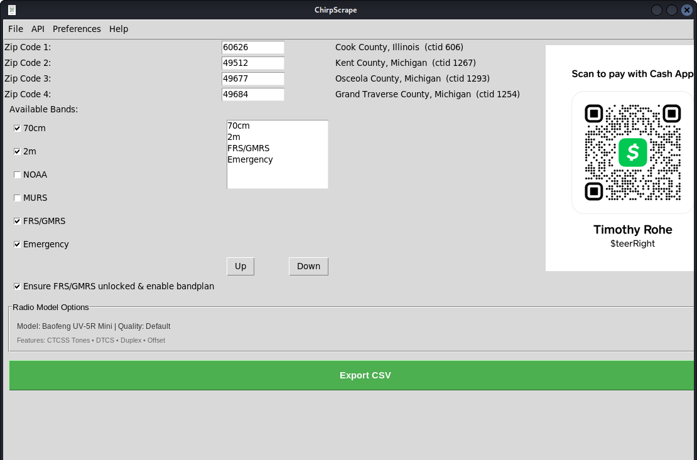

# FreqFinder Documentation

Welcome to FreqFinder - the ultimate tool for finding and programming radio frequencies for your specific location and radio model.



## Quick Start

FreqFinder automatically finds and filters radio frequencies based on your ZIP code and radio model capabilities. No more manual frequency hunting!

### What It Does
- **Enter any ZIP code** → Get all local frequencies instantly
- **Select your radio model** → Only compatible frequencies included
- **Automatic digital mode filtering** → D-STAR, P25, C4FM filtered based on radio support
- **Export to CHIRP-compatible CSV** → Ready for radio programming

### Supported Radio Types
- **Analog radios** (Baofeng UV-5R series): FM repeaters only
- **D-STAR radios** (Icom ID series): D-STAR + FM repeaters  
- **System Fusion radios** (Yaesu FTM series): C4FM + FM repeaters
- **Professional radios** (Motorola, Kenwood): P25 + FM repeaters

## Step-by-Step Guide

### 1. Install and Launch FreqFinder

#### **Mac Installation**
```bash
# Install Homebrew (if not already installed)
/bin/bash -c "$(curl -fsSL https://raw.githubusercontent.com/Homebrew/install/HEAD/install.sh)"

# Install Python 3 and required dependencies
brew install python3 tkinter

# Clone or download FreqFinder
git clone https://github.com/your-repo/FreqFinder.git
cd FreqFinder

# Install Python packages
pip3 install -r requirements.txt

# Launch FreqFinder
python3 freqfinder.py --gui
```

#### **Linux Installation (Ubuntu/Debian)**
```bash
# Update package manager
sudo apt update

# Install Python 3 and required dependencies
sudo apt install python3 python3-tk python3-pip git

# Clone or download FreqFinder
git clone https://github.com/your-repo/FreqFinder.git
cd FreqFinder

# Install Python packages
pip3 install -r requirements.txt

# Launch FreqFinder
python3 freqfinder.py --gui
```

#### **Linux Installation (Fedora/CentOS)**
```bash
# Install Python 3 and required dependencies
sudo dnf install python3 python3-tkinter python3-pip git

# Clone or download FreqFinder
git clone https://github.com/your-repo/FreqFinder.git
cd FreqFinder

# Install Python packages
pip3 install -r requirements.txt

# Launch FreqFinder
python3 freqfinder.py --gui
```

#### **Windows Installation**
```powershell
# Install Python 3.11+ from python.org
# Download and run: https://www.python.org/downloads/windows/

# During installation, check "Add Python to PATH"

# Open Command Prompt or PowerShell
# Clone or download FreqFinder
git clone https://github.com/your-repo/FreqFinder.git
cd FreqFinder

# Install Python packages
pip install -r requirements.txt

# Launch FreqFinder
python freqfinder.py --gui
```

#### **Alternative: Windows Installer**
1. Download `FreqFinder-Windows-Setup.exe` from Releases
2. Run installer and follow prompts
3. Launch from Start Menu or Desktop shortcut

#### **Alternative: Portable Version**
1. Download `FreqFinder-Portable.zip` from Releases
2. Extract to any folder
3. Run `FreqFinder.exe` (no installation required)

### 2. Enter Your Location
- Type your ZIP code (e.g., 60626 for Chicago, IL)
- Click "Add ZIP" to include multiple locations

### 3. Select Your Radio Model
Choose from the dropdown:
- **Baofeng UV-5R Mini** - Budget analog handheld
- **Icom ID-51A PLUS2** - D-STAR handheld with GPS
- **Yaesu FTM-400DR** - System Fusion mobile
- **Motorola APX** - Professional P25 radio

### 4. Choose Frequency Bands
- **2m (144-148 MHz)** - VHF ham band
- **70cm (420-450 MHz)** - UHF ham band  
- **1.25m (222-225 MHz)** - 220 MHz band
- **NOAA** - Weather radio frequencies
- **MURS/FRS-GMRS** - License-free frequencies

### 5. Export and Program
- Click "Export CSV" to save frequencies
- Import CSV into CHIRP radio programming software
- Program your radio and you're ready to communicate!

## Digital Mode Filtering

FreqFinder automatically filters digital modes based on your radio's capabilities:

| Radio Model | D-STAR | P25 | C4FM | Result |
|-------------|--------|-----|------|--------|
| Baofeng UV-5R Mini | ❌ Filtered | ❌ Filtered | ❌ Filtered | Analog only |
| Icom ID-51A | ✅ Included | ❌ Filtered | ❌ Filtered | D-STAR + Analog |
| Yaesu FTM-400DR | ❌ Filtered | ❌ Filtered | ✅ Included | C4FM + Analog |
| Motorola APX | ❌ Filtered | ✅ Included | ✅ Included | P25 + C4FM + Analog |

## Advanced Features

### Customization Levels
- **Default**: Basic analog frequencies
- **Advanced**: Includes digital modes your radio supports
- **High Quality**: Maximum frequency details and comments

### Scanner Mode
- **HamScan**: Focus on ham repeaters only
- **Emergency Comms**: Priority to emergency frequencies
- **Traveler**: Emphasize weather and travel frequencies

### Data Sources
- **RadioReference**: Comprehensive repeater database
- **RepeaterBook**: Ham radio repeater listings
- **QRZ Database**: Callsign lookup and validation

## Troubleshooting

### Common Issues

**"No frequencies found"**
- Check ZIP code is valid (5 digits)
- Ensure internet connection for data sources
- Try different data source (RadioReference vs RepeaterBook)

**"Digital frequencies appearing for analog radio"**
- Verify correct radio model selected
- Check customization level (use Default for analog-only)
- Digital filtering is automatic - contact support if issues persist

**"CSV import fails in CHIRP"**
- Ensure CSV format matches CHIRP requirements
- Check frequency ranges are supported by your radio
- Verify column headers match CHIRP expected format

### Platform-Specific Issues

**Mac Issues**
- **"python3: command not found"**: Install via Homebrew: `brew install python3`
- **"tkinter not found"**: Install via Homebrew: `brew install python-tk`
- **"Permission denied"**: Use `chmod +x freqfinder.py` and run as user (not root)

**Linux Issues**
- **"python3-tk package not found"**: 
  - Ubuntu/Debian: `sudo apt install python3-tk`
  - Fedora/CentOS: `sudo dnf install python3-tkinter`
- **"ModuleNotFoundError: No module named 'tkinter'"**: Install tkinter package for your distro
- **"Permission denied"**: Use `chmod +x freqfinder.py` or run with `python3 freqfinder.py`

**Windows Issues**
- **"python is not recognized"**: Reinstall Python and check "Add Python to PATH"
- **"pip is not recognized"**: Use `python -m pip install` instead of `pip`
- **"DLL load failed"**: Install Visual C++ Redistributable from Microsoft
- **"Access denied"**: Run Command Prompt as Administrator

**Cross-Platform Issues**
- **"ModuleNotFoundError: No module named 'requests'"**: Run `pip install requests`
- **"GUI window doesn't appear"**: Check that tkinter is properly installed
- **"Slow performance"**: Ensure good internet connection for data sources

### Getting Help

- **Radio Capabilities**: [Digital Mode Support](RADIO_DIGITAL_CAPABILITIES.md)
- **Issues**: Report bugs on GitHub repository
- **Community**: Join amateur radio forums for user support

## Features & Capabilities

### Radio Model Support
FreqFinder supports 13+ radio models with automatic digital mode filtering:

| Radio Type | Models | Digital Modes | Max Channels |
|------------|--------|---------------|--------------|
| **Analog Only** | Baofeng UV-5R/UV-82 series | None | 125 |
| **D-STAR** | Icom ID-51A, ID-5100E | D-STAR | 500-1000 |
| **System Fusion** | Yaesu FTM-400DR, FTM-100DR | C4FM | 500 |
| **Professional P25** | Motorola, Kenwood, Icom P25 | P25 | 1000-5000 |

### Export Quality Levels
Choose from 4 customization levels:

| Level | Features | Best For |
|-------|----------|----------|
| **Default** | Basic analog frequencies | Quick exports |
| **Advanced** | Digital modes + sorting | Power users |
| **High Quality** | Maximum optimization | Professional use |

### Advanced Features

#### **Customization Options**
- **Radio Model Selection**: Automatic digital mode filtering based on radio capabilities
- **Export Quality**: Choose between Default, Advanced, and High Quality modes
- **Band Priority**: Order frequency bands by importance
- **Multiple Locations**: Support up to 4 ZIP codes simultaneously

#### **Data Sources**
- **RadioReference**: Comprehensive repeater database (premium)
- **RepeaterBook**: Ham radio repeater listings (free)
- **QRZ Database**: Callsign lookup and validation
- **NOAA Weather**: Automatic weather radio frequencies

#### **User Interface Features**
- **Interactive Tooltips**: Context-sensitive help on all elements
- **Getting Started Guide**: Built-in interactive tutorial
- **Professional Themes**: 10 color themes including Dark, Solarized, Gruvbox
- **Progress Indicators**: Real-time export progress with status updates

#### **Export Options**
- **CHIRP-Compatible CSV**: Direct import into CHIRP radio programming
- **Save As Functionality**: Export to multiple locations without re-processing
- **Frequency Validation**: Automatic band checking and range validation
- **Duplicate Removal**: Intelligent frequency deduplication

## User Interface Guide

### Menu Structure
```
File → Save As, Themes, Exit
API → API Key Management  
Preferences → Radio & Export Settings
Help → Getting Started, RadioReference, Contact
```

### Main Window Layout
```
┌─ ZIP Code Entry (4 locations) ─────────────────┐
│  ZIP Code 1: [60626] → Cook County, Illinois (606) │
│  ZIP Code 2: [______]                           │
└─────────────────────────────────────────────────┘

┌─ Band Selection ──────┐ ┌─ Selected Bands ─────┐
│ ☑ 70cm (420-450 MHz)   │ │ 70cm                 │
│ ☑ 2m (144-148 MHz)     │ │ 2m                   │
│ ☐ NOAA Weather         │ │ [↑ Up] [↓ Down]     │
│ ☐ MURS/FRS-GMRS        │ └─────────────────────┘
└─────────────────────────┘

┌─ Radio Model Display ────────────────────────────┐
│ Model: Baofeng UV-5R Mini | Quality: Default      │
│ Features: CTCSS • DTCS • Duplex • Offset          │
│ Digital Modes: None (filtered automatically)      │
└───────────────────────────────────────────────────┘

[              Export CSV              ]
```

### Preferences Dialog
Configure radio model and export settings:
- **Radio Model Selection**: Choose from 13+ supported models
- **Feature Display**: See supported features for selected model
- **Quality Level**: Select export customization level
- **Live Updates**: Real-time feature display as you change settings

### Getting Started Guide
Built-in interactive tutorial covering:
- 📍 Location entry (ZIP codes and RadioReference URLs)
- 📡 Band selection and prioritization
- ⚙️ Radio model configuration
- 💾 Export and programming workflow
- 💡 Pro tips and troubleshooting

## Pro Tips

1. **Multiple ZIP Codes**: Add surrounding areas for complete coverage
2. **Radio Model Matching**: Always select exact radio model for proper filtering
3. **Band Planning**: Focus on 2m/70cm for most ham radio operations
4. **Emergency Preparedness**: Include NOAA and emergency frequencies
5. **Travel Programming**: Export frequencies for destination ZIP codes before trips

## Supported Countries

FreqFinder primarily supports:
- **United States**: Full coverage via RadioReference
- **Canada**: Limited coverage via RepeaterBook
- **International**: Basic support via Radio Browser (broadcast only)

## Data Updates

Frequency databases are updated:
- **RadioReference**: Real-time from live database
- **RepeaterBook**: Weekly updates
- **QRZ Database**: On-demand lookup
- **NOAA Weather**: Automatic updates

---

**Ready to get started?** See [Installation](INSTALL.md) for setup instructions, then continue with [Usage](USAGE.md) for detailed operation guides.

*For complete radio capability details, see [RADIO_DIGITAL_CAPABILITIES.md](RADIO_DIGITAL_CAPABILITIES.md)*
